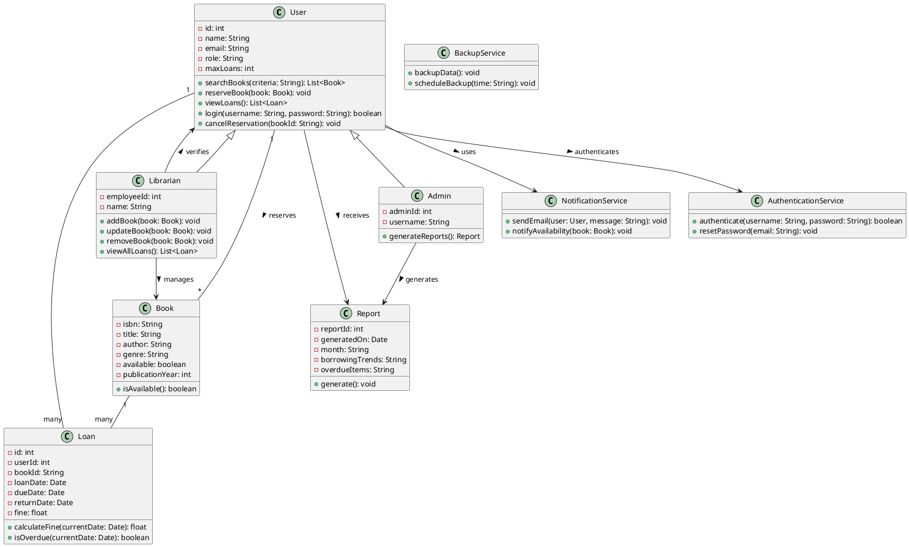

# 🏛️ Running Example: Library Management System

This repository demonstrates a complete end-to-end example of generating a UML class diagram from software requirements using a **Library Management System**.

---

## 📋 System Requirements

```
The system shall allow registered users to search for books by title, author, genre, or ISBN.
It shall enable users to reserve available books online.
The system shall automatically notify users via email when a reserved book becomes available. 
Users shall be able to view their current loans and due dates through their personal dashboard. 
The system shall restrict users from borrowing more than five books at a time. 
It shall calculate and display overdue fines based on the return date. 
Librarians shall be able to add, update, or remove book records in the catalog. 
The system shall support user authentication with role-based access control for administrators, librarians, and members. 
It shall generate monthly reports on borrowing trends and overdue items. 
The system shall back up all data to a secure cloud server daily.
```

---

## ✅ Ground Truth: UML Class Diagram (PlantUML)



---

## 🧹 Preprocessed Requirements

```
- Allow users to search books by title, author, genre, or ISBN
- Enable users to reserve books online
- Notify users via email when a reserved book is available
- Users can view loans and due dates from their dashboard
- Restrict users from borrowing more than five books
- Calculate and display overdue fines based on return date
- Librarians can add, update, or remove books from catalog
- Support authentication with role-based access: administrators, librarians, members
- Generate monthly reports on borrowing trends and overdue items
- Back up data to a secure cloud server daily
```

---

## 🧠 Extracted Entities and Relations

### 🔄 Requirement-wise UML Mapping

```
R1: Classes added: User, Book
    Book.attributes = [title, author, genre, isbn]
    User.methods = [searchBooks()]
    User -- Book [searches]

R2: No new classes
    User.methods += [reserveBook(Book)]
    User -- Book [reserves]

R3: Add class NotificationService
    NotificationService.methods = [sendEmail(User, String)]
    User --> NotificationService [receives email]

R4: Add class Loan
    Loan.attributes = [dueDate]
    User.methods += [viewLoans()]
    User.attributes += [dashboard]
    User -- Loan [has]

R5: No new classes
    User.attributes += [maxLoans]

R6: Extend Loan class
    Loan.attributes += [fine, returnDate]
    Loan.methods += [calculateFine(Date)]

R7: Add class Librarian
    Librarian.methods = [addBook(Book), updateBook(Book), removeBook(Book)]
    Librarian -- Book [manages]

R8: Add class AuthenticationService, optional: Admin
    User.attributes += [role]
    AuthenticationService.methods = [authenticate(username, password)]
    AuthenticationService --> User [authenticates]
    Admin <|-- User, Librarian <|-- User

R9: Add class Report
    Report.attributes = [month, borrowingTrends, overdueItems]
    Report -- Loan [summarizes]

R10: Add class BackupService
    BackupService.methods = [backupData()]
```

---

### 💡 Suggested Attributes & Methods

```
User
  Attributes: id: int, name: String
  Methods: login(username, password), cancelReservation(bookId)
  Relations: User --> AuthenticationService, User --> Report

Book
  Attributes: available: boolean, publicationYear: int
  Methods: isAvailable()

Loan
  Attributes: loanDate: Date, bookId: String, userId: int
  Methods: isOverdue(currentDate)

Librarian
  Attributes: employeeId: int, name: String
  Methods: viewAllLoans()
  Relations: Librarian --> User

NotificationService
  Methods: notifyAvailability(Book)

AuthenticationService
  Methods: resetPassword(email)

Report
  Attributes: reportId: int, generatedOn: Date
  Methods: generate()

BackupService
  Methods: scheduleBackup(time: String)
```

---

## 📊 Evaluation Metrics

| Metric       | Value |
| ------------ | ----- |
| Precision    | 74.3% |
| Recall       | 96.3% |
| F1 Score     | 83.9% |
| Completeness | 96.3% |
| Correctness  | 87.9% |

---

## 🧮 Metric Computation Details

* **True Positives (TP):**
  * Classes: 8
  * Attributes: 24
  * Methods: 13
  * Relationships: 7

* **False Positives (FP):**
  * Classes: 1
  * Attributes: 6
  * Methods: 7
  * Relationships: 4

* **False Negatives (FN):**
  * Attributes: 1
  * Relationships: 1

```
Precision = TP / (TP + FP) = 52 / 70 ≈ 0.743
Recall = TP / (TP + FN) = 52 / 54 ≈ 0.963
F1 Score = 2 * Precision * Recall / (Precision + Recall) ≈ 0.839
Correctness = (52 + 6 - 5 + 70) / (2 * 70) ≈ 0.879
```

---

## 📎 License

This project is for academic demonstration only.
