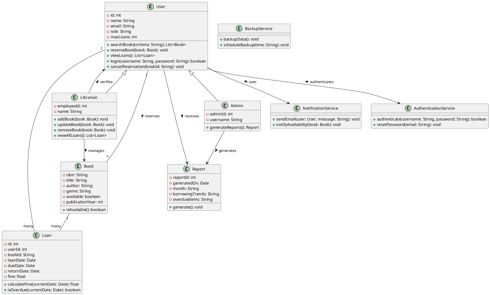

# 🏛️ Running Example: Library Management System

This repository demonstrates a complete end-to-end example of generating a UML class diagram from software requirements using a **Library Management System**.

---

## 📋 System Requirements

```
The system shall allow registered users to search for books by title, author, genre, or ISBN.
It shall enable users to reserve available books online.
The system shall automatically notify users via email when a reserved book becomes available. 
Users shall be able to view their current loans and due dates through their personal dashboard. 
The system shall restrict users from borrowing more than five books at a time. 
It shall calculate and display overdue fines based on the return date. 
Librarians shall be able to add, update, or remove book records in the catalog. 
The system shall support user authentication with role-based access control for administrators, librarians, and members. 
It shall generate monthly reports on borrowing trends and overdue items. 
The system shall back up all data to a secure cloud server daily.
```

---

## ✅ Ground Truth: UML Class Diagram (PlantUML)



---

## 🧹 Preprocessed Requirements

```
- Allow users to search books by title, author, genre, ISBN
- Enable users reserve books online
- Notify users via email when reserved book is available
- Users can view loans and due dates from their dashboard
- Restrict users from borrowing more than five books
- Calculate and display overdue fines based on return date
- Librarians can add, update, or remove books from catalog
- Support authentication with role-based access: administrators, librarians, members
- Generate monthly reports on borrowing trends and overdue items
- Back up data to a secure cloud server daily
```

---

## 🧠 Extracted Entities and Relations

### 🔄 Requirement-wise UML Mapping

```
R1: Classes added: User, Book
    Book.attributes = [title, author, genre, isbn]
    User.methods = [searchBooks()]
    User -- Book [searches]

R2: No new classes
    User.methods += [reserveBook(Book)]
    User -- Book [reserves]
    <!-- User -- Book [reserves] -->

R3: Add class NotificationService
    NotificationService.methods = [sendEmail(User, String)]
    User --> NotificationService [receives email]

R4: Add class Loan
    Loan.attributes = [dueDate]
    User.methods += [viewLoans()]
    User.attributes += [dashboard]
    User -- Loan [has]

R5: No new classes
    User.attributes += [maxLoans]

R6: Extend Loan class
    Loan.attributes += [fine, returnDate]
    Loan.methods += [calculateFine(Date)]

R7: Add class Librarian
    Librarian.methods = [addBook(Book), updateBook(Book), removeBook(Book)]
    Librarian -- Book [manages]

R8: Add class AuthenticationService
    User.attributes += [role]
    AuthenticationService.methods = [authenticate(username, password)]
    AuthenticationService --> User [authenticates]

R9: Add class Report
    Report.attributes = [month, borrowingTrends, overdueItems]
    Report -- Loan [summarizes]

R10: Add class BackupService
    BackupService.methods = [backupData()]
```

---

### 💡 Suggested Attributes & Methods

```
User
  Attributes: id: int, name: String
  Methods: login(username, password), cancelReservation(bookId)
  Relations: User --> AuthenticationService, User --> Report

Book
  Attributes: available: boolean, publicationYear: int
  Methods: isAvailable()

Loan
  Attributes: loanDate: Date, bookId: String, userId: int
  Methods: isOverdue(currentDate)

Librarian
  Attributes: employeeId: int, name: String
  Methods: viewAllLoans()
  Relations: Librarian --> User

NotificationService
  Methods: notifyAvailability(Book)

AuthenticationService
  Methods: resetPassword(email)

Report
  Attributes: reportId: int, generatedOn: Date
  Methods: generate()


BackupService
  Methods: scheduleBackup(time: String)
```

---

## 📌 Element-wise Evaluation Table

| Type       | In GT? | Element                                                       | Source                              | Impact    | Required |
|------------|--------|---------------------------------------------------------------|-------------------------------------|-----------|----------|
| Class      | TRUE   | User                                                          | Identified from R1                  | Valid     | TRUE     |
| Attribute  | TRUE   | id: int                                                       | Suggested                           | Valid     | TRUE     |
| Attribute  | TRUE   | name: String                                                  | Suggested                           | Valid     | TRUE     |
| Attribute  | TRUE   | email: String                                                 | Missed                              | Valid     | FALSE    |
| Attribute  | FALSE  | address: String                                               | Suggested                           | Valid     | FALSE    |
| Attribute  | TRUE   | role: String                                                  | Identified from R8                  | Valid     | TRUE     |
| Attribute  | FALSE  | userFingerprint: binary                                       | Identified from R8                  | Harmful   | FALSE    |
| Attribute  | TRUE   | maxLoans: int                                                 | Identified from R5                  | Valid     | TRUE     |
| Attribute  | FALSE  | preferredLanguage: String                                     | Suggested                           | Harmless  | FALSE    |
| Attribute  | FALSE  | dashboard                                                     | Identified from R4                  | Harmless  | FALSE    |
| Method     | TRUE   | searchBooks(criteria: String): List<Book>                    | Identified from R1                  | Valid     | TRUE     |
| Method     | TRUE   | viewBookCovers(): List<String>                                | Identified from R1                  | Harmless  | FALSE    |
| Method     | TRUE   | reserveBook(book: Book): void                                 | Identified from R2                  | Valid     | TRUE     |
| Method     | TRUE   | viewLoans(): List<Loan>                                       | Identified from R4                  | Valid     | FALSE    |
| Method     | TRUE   | login(username: String, password: String): boolean            | Suggested                           | Valid     | TRUE     |
| Method     | TRUE   | cancelReservation(bookId: String): void                       | Suggested                           | Valid     | TRUE     |
| Class      | TRUE   | Book                                                          | Identified from R1                  | Valid     | TRUE     |
| Attribute  | TRUE   | isbn: String                                                  | Identified from R1                  | Valid     | TRUE     |
| Attribute  | TRUE   | title: String                                                 | Identified from R1                  | Valid     | TRUE     |
| Attribute  | TRUE   | author: String                                                | Identified from R1                  | Valid     | TRUE     |
| Attribute  | TRUE   | genre: String                                                 | Identified from R1                  | Valid     | TRUE     |
| Attribute  | TRUE   | available: boolean                                            | Suggested                           | Valid     | TRUE     |
| Attribute  | TRUE   | publicationYear: int                                          | Suggested                           | Valid     | FALSE    |
| Method     | TRUE   | isAvailable(): boolean                                        | Suggested                           | Valid     | FALSE    |
| Class      | TRUE   | Loan                                                          | Identified from R4                  | Valid     | TRUE     |
| Attribute  | TRUE   | id: int                                                       | Not Identified & Not Suggested      | Valid     | TRUE     |
| Attribute  | TRUE   | userId: int                                                   | Suggested                           | Valid     | TRUE     |
| Attribute  | TRUE   | bookId: String                                                | Suggested                           | Valid     | TRUE     |
| Attribute  | TRUE   | loanDate: Date                                                | Suggested                           | Valid     | FALSE    |
| Attribute  | TRUE   | dueDate: Date                                                 | Identified from R4                  | Valid     | TRUE     |
| Attribute  | TRUE   | returnDate: Date                                              | Identified from R6                  | Valid     | TRUE     |
| Attribute  | TRUE   | fine: float                                                   | Identified from R6                  | Valid     | TRUE     |
| Method     | FALSE  | renewLoan(loanId: int): boolean                               | Identified from R4                  | Valid     | FALSE    |
| Method     | TRUE   | calculateFine(currentDate: Date): float                       | Identified from R6                  | Valid     | TRUE     |
| Method     | TRUE   | isOverdue(currentDate: Date): boolean                         | Suggested                           | Valid     | TRUE     |
| Class      | TRUE   | Librarian                                                     | Identified from R7                  | Valid     | TRUE     |
| Attribute  | TRUE   | employeeId: int                                               | Suggested                           | Valid     | TRUE     |
| Attribute  | TRUE   | name: String                                                  | Suggested                           | Valid     | TRUE     |
| Method     | TRUE   | addBook(book: Book): void                                     | Identified from R7                  | Valid     | TRUE     |
| Method     | TRUE   | updateBook(book: Book): void                                  | Identified from R7                  | Valid     | TRUE     |
| Method     | TRUE   | removeBook(book: Book): void                                  | Identified from R7                  | Valid     | TRUE     |
| Method     | FALSE  | overrideLoanLimit(userId: int): void                          | Suggested                           | Harmful   | FALSE    |
| Method     | TRUE   | viewAllLoans(): List<Loan>                                    | Suggested                           | Valid     | FALSE    |
| Class      | TRUE   | Admin                                                         | Not Identified & Not Suggested      | Valid     | TRUE     |
| Attribute  | TRUE   | adminId: int                                                  | Not Identified & Not Suggested      | Valid     | TRUE     |
| Attribute  | TRUE   | username: String                                              | Not Identified & Not Suggested      | Valid     | TRUE     |
| Method     | TRUE   | generateReports(): Report                                     | Not Identified & Not Suggested      | Valid     | TRUE     |
| Class      | TRUE   | Report                                                        | Identified from R9                  | Valid     | TRUE     |
| Attribute  | TRUE   | reportId: int                                                 | Suggested                           | Valid     | TRUE     |
| Attribute  | TRUE   | generatedOn: Date                                             | Suggested                           | Valid     | TRUE     |
| Attribute  | TRUE   | month: String                                                 | Identified from R9                  | Valid     | FALSE    |
| Attribute  | TRUE   | borrowingTrends: String                                       | Identified from R9                  | Valid     | FALSE    |
| Attribute  | TRUE   | overdueItems: String                                          | Identified from R9                  | Valid     | TRUE     |
| Method     | TRUE   | generate(): void                                              | Suggested                           | Valid     | TRUE     |
| Class      | TRUE   | NotificationService                                           | Identified from R3                  | Valid     | TRUE     |
| Method     | TRUE   | sendEmail(user: User, message: String): void                  | Identified from R3                  | Valid     | TRUE     |
| Method     | TRUE   | notifyAvailability(book: Book): void                          | Suggested                           | Valid     | FALSE    |
| Class      | TRUE   | AuthenticationService                                         | Identified from R8                  | Valid     | TRUE     |
| Method     | TRUE   | authenticate(username: String, password: String): boolean     | Identified from R8                  | Valid     | TRUE     |
| Method     | TRUE   | resetPassword(email: String): void                            | Suggested                           | Valid     | TRUE     |
| Class      | TRUE   | BackupService                                                 | Identified from R10                 | Valid     | TRUE     |
| Method     | TRUE   | backupData(): void                                            | Identified from R10                 | Valid     | TRUE     |
| Method     | TRUE   | scheduleBackup(time: String): void                            | Suggested                           | Valid     | FALSE    |
| Relation   | TRUE   | User "1" -- "many" Loan                                       | Not Identified & Not Suggested      | Valid     | TRUE     |
| Relation   | TRUE   | Book "1" -- "many" Loan                                       | Not Identified & Not Suggested      | Valid     | TRUE     |
| Relation   | TRUE   | User "1" -- "*" Book : reserves >                             | Not Identified & Not Suggested      | Valid     | TRUE     |
| Relation   | TRUE   | User --> NotificationService : uses >                         | Identified from R3                  | Valid     | TRUE     |
| Relation   | TRUE   | User --> Report : receives >                                  | Suggested                           | Valid     | TRUE     |
| Relation   | TRUE   | User --> AuthenticationService : authenticates >             | Identified from R8                  | Valid     | TRUE     |
| Relation   | TRUE   | Admin --> Report : generates >                                | Identified from R9                  | Valid     | TRUE     |
| Relation   | TRUE   | Librarian --> Book : manages >                                | Identified from R7                  | Valid     | TRUE     |
| Relation   | TRUE   | Librarian --> User : verifies >                               | Suggested                           | Valid     | TRUE     |
| Relation   | TRUE   | User <|-- Librarian                                           | Identified from R8                  | Valid     | TRUE     |
| Relation   | TRUE   | User <|-- Admin                                               | Not Identified & Not Suggested      | Valid     | TRUE     |
| Relation   | FALSE  | Librarian --> NotificationService : notifies                  | Identified from R4                  | Valid     | FALSE    |
| Relation   | FALSE  | Admin --> NotificationService : oversees                      | Identified from R4                  | Harmless  | FALSE    |
| Relation   | FALSE  | Loan --> Report : generates                                   | Suggested                           | Harmful   | FALSE    |

---

## 📈 Per-Type Evaluation Summary

| **Type**      | **GT Count** | **Correct** | **Missed** | **Extra (Valid)** | **Extra (Harmless)** | **Extra (Harmful)** | **Correctness** | **Completeness** |
| ------------- | ------------ | ----------- | ---------- | ----------------- | -------------------- | ------------------- | --------------- | ---------------- |
| **Class**     | 8            | 8           | 0          | 0                 | 0                    | 0                   | 1.000           | 1.000            |
| **Attribute** | 41           | 31          | 4          | 3                 | 2                    | 1                   | 0.872           | 0.756            |
| **Method**    | 27           | 21          | 3          | 3                 | 0                    | 2                   | 0.857           | 0.778            |
| **Relation**  | 15           | 13          | 0          | 2                 | 0                    | 2                   | 0.867           | 0.867            |
| **Overall**   | 91           | 73          | 7          | 8                 | 2                    | 5                   | 0.878           | 0.802            |

---

## 🧮 Precision, Recall, F1-Score

| **Metric**     | **Value** |
|----------------|-----------|
| **Precision**  | 0.878     |
| **Recall**     | 0.802     |
| **F1-Score**   | 0.838     |

*Where:*
- Precision = TP / (TP + FP) = 73 / (73 + 13)
- Recall = TP / (TP + FN) = 73 / (73 + 18)
- F1 = 2 × Precision × Recall / (Precision + Recall)

---

> ✅ **Conclusion**: The generated class diagram shows high correctness across all component types, especially for Classes. The model can be further improved by avoiding harmful predictions (like sensitive attributes or unsupported methods), and boosting recall through better coverage of GT items.


## 📎 License

This project is for academic demonstration only.
