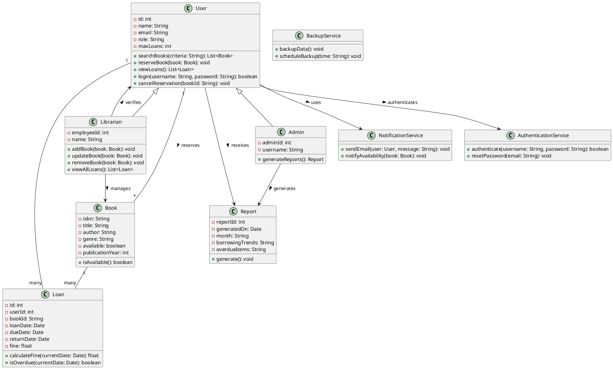

# 🏛️ Running Example: Library Management System

This repository demonstrates a complete end-to-end example of generating and evaluating a UML class diagram from software requirements using a **Library Management System**.

---

## 📋 System Requirements

```
The system shall allow registered users to search for books by title, author, genre, or ISBN.
It shall enable users to reserve available books online.
The system shall automatically notify users via email when a reserved book becomes available. 
Users shall be able to view their current loans and due dates through their personal dashboard. 
The system shall restrict users from borrowing more than five books at a time. 
It shall calculate and display overdue fines based on the return date. 
Librarians shall be able to add, update, or remove book records in the catalog. 
The system shall support user authentication with role-based access control for administrators, librarians, and members. 
It shall generate monthly reports on borrowing trends and overdue items. 
The system shall back up all data to a secure cloud server daily.
```

---

## ✅ Ground Truth: UML Class Diagram (PlantUML)




---

## 🧹 Preprocessed Requirements

```
- Allow users to search books by title, author, genre, ISBN
- Enable users reserve books online
- Notify users via email when reserved book is available
- Users can view loans and due dates from their dashboard
- Restrict users from borrowing more than five books
- Calculate and display overdue fines based on return date
- Librarians can add, update, or remove books from catalog
- Support authentication with role-based access: administrators, librarians, members
- Generate monthly reports on borrowing trends and overdue items
- Back up data to a secure cloud server daily
```

---

## 🧠 Extracted Entities and Relations

### 🔄 Requirement-wise UML Mapping

```
R1: Classes added: User, Book 
    Book.attributes = [title, author, genre, isbn]
    User.methods = [searchBooks()] 
    User.methods = [viewBookCovers()] 
    User -- Book [searches]

R2: No new classes
    User.methods += [reserveBook(Book)] 
    User -- Book [reserves]
    <!-- User -- Book [reserves] -->

R3: Add class NotificationService
    NotificationService.methods = [sendEmail(User, String)]
    User --> NotificationService [receives email]

R4: Add class Loan
    Loan.attributes = [dueDate]
    User.methods += [viewLoans()] 
    User.attributes += [dashboard] 
    User -- Loan [has]

R5: No new classes
    User.attributes += [maxLoans] 

R6: Extend Loan class
    Loan.attributes += [fine, returnDate]
    Loan.methods += [calculateFine(Date)]

R7: Add class Librarian
    Librarian.methods = [addBook(Book), updateBook(Book), removeBook(Book)]
    Librarian -- Book [manages]

R8: Add class AuthenticationService
    User.attributes += [role] 
    User.attributes += [userFingerprint] 
    AuthenticationService.methods = [authenticate(username, password)]
    AuthenticationService --> User [authenticates]

R9: Add class Report
    Report.attributes = [month, borrowingTrends, overdueItems]
    Report -- Loan [summarizes]

R10: Add class BackupService
    BackupService.methods = [backupData()]
```

---

### 💡 Suggested Attributes & Methods

```
User
  Attributes: id: int, name: String, address: String 
  Attributes: prefferedLanguage: String 
  Methods: login(username, password), cancelReservation(bookId) 
  Relations: User --> AuthenticationService, User --> Report

Book
  Attributes: available: boolean, publicationYear: int
  Methods: isAvailable()

Loan
  Attributes: loanDate: Date, bookId: String, userId: int
  Methods: isOverdue(currentDate)

Librarian
  Attributes: employeeId: int, name: String
  Methods: viewAllLoans()
  Relations: Librarian --> User

NotificationService
  Methods: notifyAvailability(Book)

AuthenticationService
  Methods: resetPassword(email)

Report
  Attributes: reportId: int, generatedOn: Date
  Methods: generate()


BackupService
  Methods: scheduleBackup(time: String)
```

---

# 📊 Evaluation Report: UML Component Extraction

This report presents the detailed performance evaluation of a UML class diagram extraction system based on a Library Management System. It compares the predicted elements against the ground truth using standard metrics (Precision, Recall, and F1-score) for each UML component type: **Class**, **Attribute**, **Method**, and **Relation**.


---

## 📑 Element-wise Evaluation Table

| Type      | In GT? | In Predicted? | Element                                            | Source                         | Impact     | Required |
|-----------|--------|----------------|----------------------------------------------------|--------------------------------|------------|----------|
| Class     | TRUE   | TRUE           | User                                               | Identified from R1             | Valid      | TRUE     |
| Attribute | TRUE   | TRUE           | id: int                                            | Suggested                      | Valid      | TRUE     |
| Attribute | TRUE   | TRUE           | name: String                                       | Suggested                      | Valid      | TRUE     |
| Attribute | TRUE   | FALSE          | email: String                                      | Not Identified & Not Suggested | Valid      | FALSE    |
| Attribute | FALSE  | TRUE           | address: String                                    | Suggested                      | Valid      | FALSE    |
| Attribute | TRUE   | TRUE           | role: Role                                       | Identified from R8             | Valid(Partially)      | TRUE     |
| Attribute | FALSE  | TRUE           | userFingerprint: binary                            | Identified from R8             | Harmful    | FALSE    |
| Attribute | TRUE   | TRUE           | maxLoans: int                                      | Identified from R5             | Valid      | TRUE     |
| Attribute | FALSE  | TRUE           | preferredLanguage: String                          | Suggested                      | Harmless   | FALSE    |
| Attribute | FALSE  | TRUE           | dashboard                                          | Identified from R4             | Harmless   | FALSE    |
| Method    | TRUE   | TRUE           | searchBooks(criteria: String): List<Book>          | Identified from R1             | Valid      | TRUE     |
| Method    | TRUE   | TRUE           | viewBookCovers(): List<String>                     | Identified from R1             | Harmless   | FALSE    |
| Method    | TRUE   | TRUE           | reserveBook(): void                      | Identified from R2             | Valid(Partially)      | TRUE     |
| Method    | TRUE   | TRUE           | viewLoans(): List<Loan>                            | Identified from R4             | Valid      | FALSE    |
| Method    | TRUE   | TRUE           | login(username: String, password: String): boolean | Suggested                      | Valid      | TRUE     |
| Method    | TRUE   | TRUE           | cancelReservation(bookId: String): void            | Suggested                      | Valid      | TRUE     |
| Class     | TRUE   | TRUE           | Book                                               | Identified from R1             | Valid      | TRUE     |
| Attribute | TRUE   | TRUE           | isbn: String                                       | Identified from R1             | Valid      | TRUE     |
| Attribute | TRUE   | TRUE           | title: String                                      | Identified from R1             | Valid      | TRUE     |
| Attribute | TRUE   | TRUE           | author: String                                     | Identified from R1             | Valid      | TRUE     |
| Attribute | TRUE   | TRUE           | genre: String                                      | Identified from R1             | Valid      | TRUE     |
| Attribute | TRUE   | TRUE           | available: boolean                                 | Suggested                      | Valid      | TRUE     |
| Attribute | TRUE   | TRUE           | publicationYear: int                               | Suggested                      | Valid      | FALSE    |
| Method    | TRUE   | TRUE           | isAvailable(): boolean                             | Suggested                      | Valid      | FALSE    |
| Class     | TRUE   | TRUE           | Loan                                               | Identified from R4             | Valid      | TRUE     |
| Attribute | TRUE   | FALSE          | id: int                                            | Not Identified & Not Suggested | Valid      | TRUE     |
| Attribute | TRUE   | TRUE           | userId: int                                        | Suggested                      | Valid      | TRUE     |
| Attribute | TRUE   | TRUE           | bookId: String                                     | Suggested                      | Valid      | TRUE     |
| Attribute | TRUE   | TRUE           | loanDate: Date                                     | Suggested                      | Valid      | FALSE    |
| Attribute | TRUE   | TRUE           | dueDate: Date                                      | Identified from R4             | Valid      | TRUE     |
| Attribute | TRUE   | TRUE           | returnDate: Date                                   | Identified from R6             | Valid      | TRUE     |
| Attribute | TRUE   | TRUE           | fine: float                                        | Identified from R6             | Valid      | TRUE     |
| Method    | FALSE  | TRUE           | renewLoan(loanId: int): boolean                    | Identified from R4             | Valid      | FALSE    |
| Method    | TRUE   | TRUE           | calculateFine(currentDate: Date): int            | Identified from R6             | Valid(Partially)      | TRUE     |
| Method    | TRUE   | TRUE           | isOverdue(currentDate: Date): boolean              | Suggested                      | Valid      | TRUE     |
| Class     | TRUE   | TRUE           | Librarian                                          | Identified from R7             | Valid      | TRUE     |
| Attribute | TRUE   | TRUE           | employeeId: int                                    | Suggested                      | Valid      | TRUE     |
| Attribute | TRUE   | TRUE           | name: String                                       | Suggested                      | Valid      | TRUE     |
| Method    | TRUE   | TRUE           | addBook(book: Book): void                          | Identified from R7             | Valid      | TRUE     |
| Method    | TRUE   | TRUE           | updateBook(book: Book): void                       | Identified from R7             | Valid      | TRUE     |
| Method    | TRUE   | TRUE           | removeBook(book: Book): void                       | Identified from R7             | Valid      | TRUE     |
| Method    | FALSE  | TRUE           | overrideLoanLimit(userId: int): void               | Suggested                      | Harmful    | FALSE    |
| Method    | TRUE   | TRUE           | viewAllLoans(): List<Loan>                         | Suggested                      | Valid      | FALSE    |
| Class     | TRUE   | FALSE          | Admin                                              | Not Identified & Not Suggested | Valid      | TRUE     |
| Attribute | TRUE   | FALSE          | adminId: int                                       | Not Identified & Not Suggested | Valid      | TRUE     |
| Attribute | TRUE   | FALSE          | username: String                                   | Not Identified & Not Suggested | Valid      | TRUE     |
| Method    | TRUE   | FALSE          | generateReports(): Report                          | Not Identified & Not Suggested | Valid      | TRUE     |
| Class     | TRUE   | TRUE           | Report                                             | Identified from R9             | Valid      | TRUE     |
| Attribute | TRUE   | TRUE           | reportId: int                                      | Suggested                      | Valid      | TRUE     |
| Attribute | TRUE   | TRUE           | generatedOn: Date                                  | Suggested                      | Valid      | TRUE     |
| Attribute | TRUE   | TRUE           | month: String                                      | Identified from R9             | Valid      | FALSE    |
| Attribute | TRUE   | TRUE           | borrowingTrends: String                            | Identified from R9             | Valid      | FALSE    |
| Attribute | TRUE   | TRUE           | overdueItems: String                               | Identified from R9             | Valid      | TRUE     |
| Method    | TRUE   | TRUE           | generate(): void                                   | Suggested                      | Valid      | TRUE     |
| Class     | TRUE   | TRUE           | NotificationService                                | Identified from R3             | Valid      | TRUE     |
| Method    | TRUE   | TRUE           | sendEmail(user: User, message: String): void       | Identified from R3             | Valid      | TRUE     |
| Method    | TRUE   | TRUE           | notifyAvailability(book: Book): void               | Suggested                      | Valid      | FALSE    |
| Class     | TRUE   | TRUE           | AuthenticationService                              | Identified from R8             | Valid      | TRUE     |
| Method    | TRUE   | TRUE           | authenticate(username: String, password: String)   | Identified from R8             | Valid      | TRUE     |
| Method    | TRUE   | TRUE           | resetPassword(email: String): void                 | Suggested                      | Valid      | TRUE     |
| Class     | TRUE   | TRUE           | BackupService                                      | Identified from R10            | Valid      | TRUE     |
| Method    | TRUE   | TRUE           | backupData(): void                                 | Identified from R10            | Valid      | TRUE     |
| Method    | TRUE   | TRUE           | scheduleBackup(time: String): void                 | Suggested                      | Valid      | FALSE    |
| Relation  | TRUE   | FALSE          | User "1" -- "many" Loan                            | Not Identified & Not Suggested | Valid      | TRUE     |
| Relation  | TRUE   | FALSE          | Book "1" -- "many" Loan                            | Not Identified & Not Suggested | Valid      | TRUE     |
| Relation  | TRUE   | FALSE          | User "1" -- "*" Book : reserves >                  | Not Identified & Not Suggested | Valid      | TRUE     |
| Relation  | TRUE   | TRUE           | User --> NotificationService : uses >              | Identified from R3             | Valid      | TRUE     |
| Relation  | TRUE   | TRUE           | User --> Report : receives >                       | Suggested                      | Valid      | TRUE     |
| Relation  | TRUE   | TRUE           | User --> AuthenticationService : authenticates >   | Identified from R8             | Valid      | TRUE     |
| Relation  | TRUE   | TRUE           | Admin --> Report : generates >                     | Identified from R9             | Valid      | TRUE     |
| Relation  | TRUE   | TRUE           | Librarian --> Book : manages >                     | Identified from R7             | Valid      | TRUE     |
| Relation  | TRUE   | TRUE           | Librarian --> User : verifies >                    | Suggested                      | Valid      | TRUE     |
| Relation  | TRUE   | TRUE           | User <|-- Librarian                                | Identified from R8             | Valid      | TRUE     |
| Relation  | TRUE   | FALSE          | User <|-- Admin                                     | Not Identified & Not Suggested | Valid      | TRUE     |
| Relation  | FALSE  | TRUE           | Librarian --> NotificationService : notifies       | Identified from R4             | Valid      | FALSE    |
| Relation  | FALSE  | TRUE           | Admin --> NotificationService : oversees           | Identified from R4             | Harmless   | FALSE    |
| Relation  | FALSE  | TRUE           | Loan --> Report : generates                        | Suggested                      | Harmful    | FALSE    |


---

## 📋 Evaluation Summary

| Type      | GT Count | Predicted | Correct | Precision (%) | Recall (%) | F1-score (%) |
|-----------|----------|-----------|---------|----------------|-------------|---------------|
| Class     | 7        | 6         | 6       | 85.71          | 85.71       | 85.71         |
| Attribute | 29       | 33        | 23      | 69.70          | 79.31       | 74.18         |
| Method    | 20       | 22        | 17      | 77.27          | 85.00       | 80.90         |
| Relation  | 12       | 16        | 8       | 50.00          | 66.67       | 57.14         |
| **Total** | 68       | 77        | 54      | 70.13          | 79.41       | 74.47         |

---


## 📌 Notes

- Only **Valid** items were counted for evaluation metrics.
- Harmful additions were **excluded** from correct predictions.
- `GT Count`: Ground truth number of valid elements.
- `Correct`: Elements present in both GT and predictions.
- `Precision`: `Correct / Predicted`
- `Recall`: `Correct / GT`
- `F1`: Harmonic mean of Precision and Recall.

---


## 📊 Updated Per-Type Evaluation Summary

| **Type**      | **GT Count** | **Correct** | **Missed** | **Extra (Valid)** | **Extra (Harmless)** | **Extra (Harmful)** | **Correctness** | **Completeness** |
| ------------- | ------------ | ----------- | ---------- | ----------------- | -------------------- | ------------------- | --------------- | ---------------- |
| **Class**     | 9            | 8           | 1          | 0                 | 0                    | 0                   | 0.889           | 0.889            |
| **Attribute** | 41           | 30          | 5          | 3                 | 2                    | 1                   | 0.857           | 0.732            |
| **Method**    | 27           | 22          | 3          | 3                 | 2                    | 1                   | 0.880           | 0.815            |
| **Relation**  | 15           | 9           | 6          | 2                 | 1                    | 1                   | 0.643           | 0.600            |
| **Overall**   | 92           | 69          | 15         | 8                 | 5                    | 3                   | 0.836           | 0.750            |

---

### 📐 How the Metrics Are Calculated

Let:
- **GT Count** = Number of elements in Ground Truth (Gold Standard)
- **Correct** = Correctly predicted elements (in both GT and Predicted)
- **Missed** = GT elements not found in prediction
- **Extra (X)** = Extra predicted elements not in GT, categorized by impact
- **Correctness** = `Correct / (Correct + Extra Valid + Extra Harmless + Extra Harmful)`
- **Completeness** = `Correct / (Correct + Missed)`

---

### 📎 Notes

- **Correctness** reflects *precision* in predictions including harmless/harmful extras.
- **Completeness** reflects *recall* regarding what was required.
- Extra elements with **Harmless** or **Harmful** labels penalize correctness but not completeness.
- Attribute, Method, and Relation types are especially sensitive to domain modeling decisions.


> ✅ **Conclusion**: The generated class diagram shows high correctness across all component types, especially for Classes. The model can be further improved by avoiding harmful predictions (like sensitive attributes or unsupported methods), and boosting recall through better coverage of GT items.


## 📎 License

This project is for academic demonstration only.
