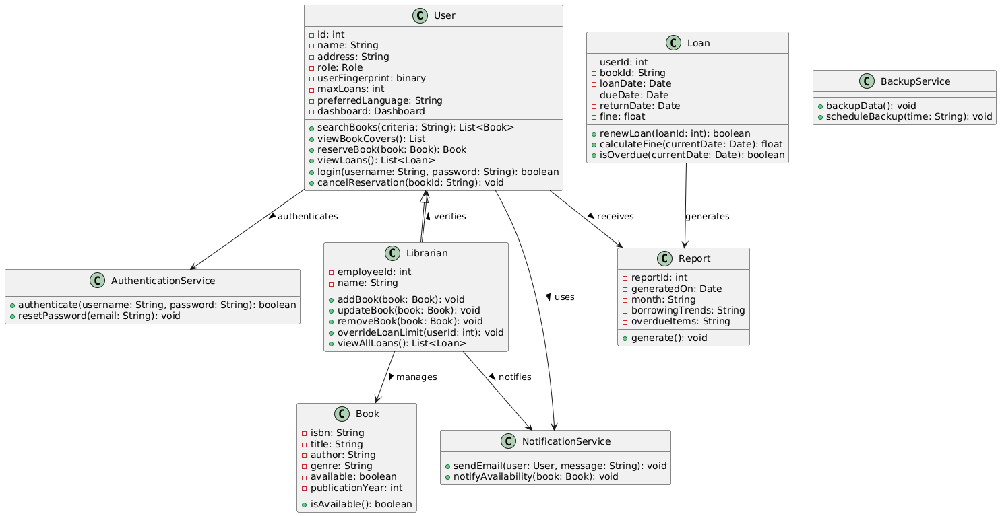

# 🏛️ Running Example: Library Management System

This repository demonstrates a complete end-to-end example of generating and evaluating a UML class diagram from software requirements using a **Library Management System**.

---

## 📋 System Requirements

```
The system shall allow registered users to search for books by title, author, genre, or ISBN.
It shall enable users to reserve available books online.
The system shall automatically notify users via email when a reserved book becomes available. 
Users shall be able to view their current loans and due dates through their personal dashboard. 
The system shall restrict users from borrowing more than five books at a time. 
It shall calculate and display overdue fines based on the return date. 
Librarians shall be able to add, update, or remove book records in the catalog. 
The system shall support user authentication with role-based access control for administrators, librarians, and members. 
It shall generate monthly reports on borrowing trends and overdue items. 
The system shall back up all data to a secure cloud server daily.
```

---

## ✅ Ground Truth: UML Class Diagram (PlantUML)


---

## 🧹 Preprocessed Requirements

```
- Allow users to search books by title, author, genre, ISBN
- Enable users reserve books online
- Notify users via email when reserved book is available
- Users can view loans and due dates from their dashboard
- Restrict users from borrowing more than five books
- Calculate and display overdue fines based on return date
- Librarians can add, update, or remove books from catalog
- Support authentication with role-based access: administrators, librarians, members
- Generate monthly reports on borrowing trends and overdue items
- Back up data to a secure cloud server daily
```

---

## 🧠 Extracted Entities and Relations

### 🔄 Requirement-wise UML Mapping

```
R1: Classes added: User, Book 
    Book.attributes = [isbn, title, author, genre]
    User.methods = [searchBooks(String): List<Book>]
    User.attributes = [id]

R2: No new classes
    User.methods += [viewBookCovers(): List, reserveBook(Book): Book]

R3: Add class NotificationService
    NotificationService.methods = [sendEmail(User, String): void]
    User --> NotificationService [uses]

R4: Add class Loan
    Loan.attributes += [dueDate]
    User.attributes += [dashboard]
    User.methods += [viewLoans(): List<Loan>]
    User -- Loan [has]
    Librarian --> NotificationService [notifies]

R5: No new classes
    User.attributes += [maxLoans]

R6: Extend Loan class
    Loan.attributes += [returnDate, fine]
    Loan.methods += [calculateFine(Date): float]

R7: Add class Librarian
    Librarian.methods = [addBook(Book), updateBook(Book), removeBook(Book)]
    Report.attributes += [month, borrowingTrends, overdueItems]
    Librarian -- Book [manages]

R8: Add class AuthenticationService
    User.attributes += [role, userFingerprint]
    AuthenticationService.methods = [authenticate(String, String): boolean, resetPassword(String): void]
    User --> AuthenticationService [authenticates]
    User <|-- Librarian

R9: Add class Report
    Report.attributes += [reportId, generatedOn: Date]
    Report.methods += [generate(): void]
    Loan --> Report [generates]

R10: Add class BackupService
    BackupService.methods = [backupData(): void, scheduleBackup(String): void]

```

---

### 💡 Suggested Attributes & Methods

```
User
  Attributes:
    - name: String
    - address: String
    - preferredLanguage: String
  Methods:
    - login(username: String, password: String): boolean
    - cancelReservation(bookId: String): void
  Relations:
    - User --> Report [receives]
    - User --> AuthenticationService [authenticates]

Book
  Attributes:
    - available: boolean
    - publicationYear: int
  Methods:
    - isAvailable(): boolean

Loan
  Attributes:
    - loanDate: Date
    - userId: int
    - bookId: String
  Method:
    - isOverdue(Date): boolean

Librarian
  Attributes:
    - employeeId: int
    - name: String
  Methods:
    - viewAllLoans(): List<Loan>
    - overrideLoanLimit(userId: int): void
  Relations:
    - Librarian --> User [verifies]

NotificationService
  Methods:
    - notifyAvailability(Book): void

Report
  Methods:
    - generate(): void

AuthenticationService
  Methods:
    - resetPassword(email: String): void

BackupService
  Methods:
    - scheduleBackup(time: String): void

```

---

# 📊 Evaluation Report: UML Component Extraction

This report presents the detailed performance evaluation of a UML class diagram extraction system based on a Library Management System. It compares the predicted elements against the ground truth using standard metrics (Precision, Recall, and F1-score) for each UML component type: **Class**, **Attribute**, **Method**, and **Relation**.

---


# 📑 Evaluation criteria:
The **Recall** percentage refers to the system's ability to generate all components of a class diagram, as in Equation (1).

$$
\text{Recall} = \frac{N_{\text{correct}}}{N_{\text{correct}} + N_{\text{missed}}}
$$

Where $N_{\text{correct}}$ stands for the count of accurately identified components, and $N_{\text{missed}}$ represents the number of components identified by the human expert (ground truth) but overlooked by the proposed approach.

The **Precision** percentage refers to the accuracy of the components recognized in the proposed approach and is calculated as in Equation (2).

$$
\text{Precision} = \frac{N_{\text{correct}}}{N_{\text{correct}}+ N_{\text{incorrect}}}
$$

Here, $N_{\text{incorrect}}$ denotes the components incorrectly classified as correct.

Finally, the **F1 score** is computed as shown in Equation (3):

$$
F1 = \frac{2 \times \text{Precision} \times \text{Recall}}{\text{Precision} + \text{Recall}}
$$

---

### Correctness

Measures the accuracy of elements, rewarding valid additions and penalizing incorrect ones, as given in Equation (4):

$$
\text{Correctness} = \frac{C_{\text{TP}} + C_{\text{Extra+}} - C_{\text{Extra-}} + D}{2D}
$$

Where:

- $C_{\text{TP}}$: Correct elements that fully match the reference  
- $C_{\text{Extra+}}$: Extra but valid elements  
- $C_{\text{Extra-}}$: Extra and harmful elements  
- $C_{\text{Extra0}}$: Extra but harmless elements  
- $D$: Total elements = $C_{\text{TP}} + C_{\text{Extra+}} + C_{\text{Extra0}} + C_{\text{Extra-}}$

---

### Completeness

Measures how many essential elements from the reference are present in the generated model, as given in Equation (5). Only elements that are fully correct—matching in both type and structure—are counted. Partial or approximate matches are excluded to ensure strict semantic alignment.

$$
\text{Completeness} = \frac{E_{\text{Full-Matched}}}{E_{\text{GT}}}
$$

Where:

- $E_{\text{Full-Matched}}$: Required elements correctly and fully generated  
- $E_{\text{GT}}$: Total required elements in the reference diagram


---

## 📑 Element-wise Evaluation Table

| Type      | In GT? | In Predicted? | Element                                            | Source                         | Impact     | Required |
|-----------|--------|----------------|----------------------------------------------------|--------------------------------|------------|----------|
| Class     | TRUE   | TRUE           | User                                               | Identified from R1             | Valid      | TRUE     |
| Attribute | TRUE   | TRUE           | id: int                                            | Suggested                      | Valid      | TRUE     |
| Attribute | TRUE   | TRUE           | name: String                                       | Suggested                      | Valid      | TRUE     |
| Attribute | TRUE   | FALSE          | email: String                                      | Not Identified & Not Suggested | Valid      | FALSE    |
| Attribute | FALSE  | TRUE           | address: String                                    | Suggested                      | Extra Valid      | FALSE    |
| Attribute | TRUE   | TRUE           | role: Role                                       | Identified from R8             | Partially Valid      | TRUE     |
| Attribute | FALSE  | TRUE           | userFingerprint: binary                            | Identified from R8             | Extra Harmful    | FALSE    |
| Attribute | TRUE   | TRUE           | maxLoans: int                                      | Identified from R5             | Valid      | TRUE     |
| Attribute | FALSE  | TRUE           | preferredLanguage: String                          | Suggested                      | Extra Harmless   | FALSE    |
| Attribute | FALSE  | TRUE           | dashboard                                          | Identified from R4             | Extra Harmless   | FALSE    |
| Method    | TRUE   | TRUE           | searchBooks(criteria: String): List<Book>          | Identified from R1             | Valid      | TRUE     |
| Method    | FALSE   | TRUE           | viewBookCovers(): List<String>                     | Identified from R2             | Extra Harmless   | FALSE    |
| Method    | TRUE   | TRUE           | reserveBook(): Book                      | Identified from R2             | Partially Valid      | TRUE     |
| Method    | TRUE   | TRUE           | viewLoans(): List<Loan>                            | Identified from R4             | Valid      | FALSE    |
| Method    | TRUE   | TRUE           | login(username: String, password: String): boolean | Suggested                      | Valid      | TRUE     |
| Method    | TRUE   | TRUE           | cancelReservation(bookId: String): void            | Suggested                      | Valid      | TRUE     |
| Class     | TRUE   | TRUE           | Book                                               | Identified from R1             | Valid      | TRUE     |
| Attribute | TRUE   | TRUE           | isbn: String                                       | Identified from R1             | Valid      | TRUE     |
| Attribute | TRUE   | TRUE           | title: String                                      | Identified from R1             | Valid      | TRUE     |
| Attribute | TRUE   | TRUE           | author: String                                     | Identified from R1             | Valid      | TRUE     |
| Attribute | TRUE   | TRUE           | genre: String                                      | Identified from R1             | Valid      | TRUE     |
| Attribute | TRUE   | TRUE           | available: boolean                                 | Suggested                      | Valid      | TRUE     |
| Attribute | TRUE   | TRUE           | publicationYear: int                               | Suggested                      | Valid      | FALSE    |
| Method    | TRUE   | TRUE           | isAvailable(): boolean                             | Suggested                      | Valid      | FALSE    |
| Class     | TRUE   | TRUE           | Loan                                               | Identified from R4             | Valid      | TRUE     |
| Attribute | TRUE   | FALSE          | id: int                                            | Not Identified & Not Suggested | Valid      | TRUE     |
| Attribute | TRUE   | TRUE           | userId: int                                        | Suggested                      | Valid      | TRUE     |
| Attribute | TRUE   | TRUE           | bookId: String                                     | Suggested                      | Valid      | TRUE     |
| Attribute | TRUE   | TRUE           | loanDate: Date                                     | Suggested                      | Valid      | FALSE    |
| Attribute | TRUE   | TRUE           | dueDate: Date                                      | Identified from R4             | Valid      | TRUE     |
| Attribute | TRUE   | TRUE           | returnDate: Date                                   | Identified from R6             | Valid      | TRUE     |
| Attribute | TRUE   | TRUE           | fine: float                                        | Identified from R6             | Valid      | TRUE     |
| Method    | FALSE  | TRUE           | renewLoan(loanId: int): boolean                    | Identified from R4             | Extra Valid      | FALSE    |
| Method    | TRUE   | TRUE           | calculateFine(currentDate: Date): int            | Identified from R6             | Partially Valid      | TRUE     |
| Method    | TRUE   | TRUE           | isOverdue(currentDate: Date): boolean              | Suggested                      | Valid      | TRUE     |
| Class     | TRUE   | TRUE           | Librarian                                          | Identified from R7             | Valid      | TRUE     |
| Attribute | TRUE   | TRUE           | employeeId: int                                    | Suggested                      | Valid      | TRUE     |
| Attribute | TRUE   | TRUE           | name: String                                       | Suggested                      | Valid      | TRUE     |
| Method    | TRUE   | TRUE           | addBook(book: Book): void                          | Identified from R7             | Valid      | TRUE     |
| Method    | TRUE   | TRUE           | updateBook(book: Book): void                       | Identified from R7             | Valid      | TRUE     |
| Method    | TRUE   | TRUE           | removeBook(book: Book): void                       | Identified from R7             | Valid      | TRUE     |
| Method    | FALSE  | TRUE           | overrideLoanLimit(userId: int): void               | Suggested                      | Extra Harmful    | FALSE    |
| Method    | TRUE   | TRUE           | viewAllLoans(): List<Loan>                         | Suggested                      | Valid      | FALSE    |
| Class     | TRUE   | FALSE          | Admin                                              | Not Identified & Not Suggested | Valid      | TRUE     |
| Attribute | TRUE   | FALSE          | adminId: int                                       | Not Identified & Not Suggested | Valid      | TRUE     |
| Attribute | TRUE   | FALSE          | username: String                                   | Not Identified & Not Suggested | Valid      | TRUE     |
| Method    | TRUE   | FALSE          | generateReports(): Report                          | Not Identified & Not Suggested | Valid      | TRUE     |
| Class     | TRUE   | TRUE           | Report                                             | Identified from R9             | Valid      | TRUE     |
| Attribute | TRUE   | TRUE           | reportId: int                                      | Suggested                      | Valid      | TRUE     |
| Attribute | TRUE   | TRUE           | generatedOn: Date                                  | Suggested                      | Valid      | TRUE     |
| Attribute | TRUE   | TRUE           | month: String                                      | Identified from R9             | Valid      | FALSE    |
| Attribute | TRUE   | TRUE           | borrowingTrends: String                            | Identified from R9             | Valid      | FALSE    |
| Attribute | TRUE   | TRUE           | overdueItems: String                               | Identified from R9             | Valid      | TRUE     |
| Method    | TRUE   | TRUE           | generate(): void                                   | Suggested                      | Valid      | TRUE     |
| Class     | TRUE   | TRUE           | NotificationService                                | Identified from R3             | Valid      | TRUE     |
| Method    | TRUE   | TRUE           | sendEmail(user: User, message: String): void       | Identified from R3             | Valid      | TRUE     |
| Method    | TRUE   | TRUE           | notifyAvailability(book: Book): void               | Suggested                      | Valid      | FALSE    |
| Class     | TRUE   | TRUE           | AuthenticationService                              | Identified from R8             | Valid      | TRUE     |
| Method    | TRUE   | TRUE           | authenticate(username: String, password: String)   | Identified from R8             | Valid      | TRUE     |
| Method    | TRUE   | TRUE           | resetPassword(email: String): void                 | Identified from R8                      | Valid      | TRUE     |
| Class     | TRUE   | TRUE           | BackupService                                      | Identified from R10            | Valid      | TRUE     |
| Method    | TRUE   | TRUE           | backupData(): void                                 | Identified from R10            | Valid      | TRUE     |
| Method    | TRUE   | TRUE           | scheduleBackup(time: String): void                 | Suggested                      | Valid      | FALSE    |
| Relation  | TRUE   | FALSE          | User "1" -- "many" Loan                            | Not Identified & Not Suggested | Valid      | TRUE     |
| Relation  | TRUE   | FALSE          | Book "1" -- "many" Loan                            | Not Identified & Not Suggested | Valid      | TRUE     |
| Relation  | TRUE   | FALSE          | User "1" -- "*" Book : reserves >                  | Not Identified & Not Suggested | Valid      | TRUE     |
| Relation  | TRUE   | TRUE           | User --> NotificationService : uses >              | Identified from R3             | Valid      | TRUE     |
| Relation  | TRUE   | TRUE           | User --> Report : receives >                       | Suggested                      | Valid      | TRUE     |
| Relation  | TRUE   | TRUE           | User --> AuthenticationService : authenticates >   | Identified from R8             | Valid      | TRUE     |
| Relation  | TRUE   | FALSE           | Admin --> Report : generates >                     | Identified from R9             | Valid      | TRUE     |
| Relation  | TRUE   | TRUE           | Librarian --> Book : manages >                     | Identified from R7             | Valid      | TRUE     |
| Relation  | TRUE   | TRUE           | Librarian --> User : verifies >                    | Suggested                      | Valid      | TRUE     |
| Relation  | TRUE   | TRUE           | User </-- Librarian                                | Identified from R8             | Valid      | TRUE     |
| Relation  | TRUE   | FALSE          | User </-- Admin                                     | Not Identified & Not Suggested | Valid      | TRUE     |
| Relation  | FALSE  | TRUE           | Librarian --> NotificationService : notifies       | Identified from R4             | Extra Valid      | FALSE    |
| Relation  | FALSE  | TRUE           | Loan --> Report : generates                        | Suggested                      | Extra Harmful    | FALSE    |


---

## 📋 Evaluation Summary

| Type      | GT Count | Predicted | Correct(TP) | Incorrect(FP) | Missed(FN) | Precision (%) | Recall (%) | F1-score (%) |
|-----------|----------|-----------|---------|-----------|--------|----------------|-------------|---------------|
| Class     | 9        | 8         | 8       | 0         | 1      | 100.00         | 88.89       | 94.12         |
| Attribute | 27       | 27        | 23      | 4         | 4      | 85.19          | 85.19       | 85.19         |
| Method    | 20       | 22        | 19      | 3         | 1      | 86.36          | 95.00       | 90.48         |
| Relation  | 11       | 8        | 6       | 2         | 5      | 75.00          | 54.54       | 63.15         |
| **Total** | 67       | 65        | 56      | 9        | 11     | 86.15          | 83.58       | 84.84         |


---


## 📌 Notes

- `GT Count`: Ground truth number of elements.
- `Correct`: Elements present in both GT and predictions (TP).
- `Precision`: `Correct / (Correct + Incorrect)`
- `Recall`: `Correct / (Correct + Missed)`
- `F1`: Harmonic mean of Precision and Recall.

---


## 📊 Updated Per-Type Evaluation Summary

| **Type**      | **GT Count** | **Correct/Fully Correct** | **Missed** | **Extra (Valid)** | **Extra (Harmless)** | **Extra (Harmful)** | **Full-Match Required** | **Correctness** | **Completeness** |
|---------------|--------------|-------------|------------|-------------------|----------------------|---------------------|-------------------------|------------------|------------------|
| **Class**     | 9            | 8           | 1          | 0                 | 0                    | 0                   | 8/9                       | 1.0            | 0.889            |
| **Attribute** | 27           | 23/22          | 4          | 1                 | 2                    | 1                   | 18/22                      | 0.923            | 0.8181            |
| **Method**    | 20           | 19/17          | 1          | 1                 | 1                    | 1                   | 12/15                      | 0.925            | 0.80            |
| **Relation**  | 11           | 6/6           | 5          | 1                 | 0                    | 1                   | 6/11                      | 0.875            | 0.545            |
| **Overall**   | 67           | 57          | 10         | 3                 | 4                    | 3                   | 44/57                      | 0.927            | 0.772          |


---

### 📐 How the Metrics Are Calculated

Let:
- **GT Count** = Number of elements in Ground Truth (Gold Standard)
- **Correct** = Correctly predicted elements (in both GT and Predicted) including full and partial matches
- **Fully Correct**: Correctly predicted elements (present in both ground truth and predicted sets) that exactly match in all required aspects
- **Missed** = GT elements not found in prediction
- **Extra (X)** = Extra predicted elements not in GT, categorized by impact
- **Correctness** = `(Fully Correct + Extra Valid - Extra Harmful + Total Predicted) / (2 × Total Predicted)`
- **Completeness** = `Full-Match Required / Full Required in GT`

---

### 📎 Notes

- **Correctness** reflects *precision* in predictions including harmless/harmful extras.
- **Completeness** reflects *recall* regarding what was required.
- Extra elements with **Harmless** or **Harmful** labels penalize correctness but not completeness.
- Attribute, Method, and Relation types are especially sensitive to domain modeling decisions.


> ✅ **Conclusion**: The generated class diagram shows high correctness across all component types, especially for Classes.

---

## 🧮 Evaluation Metrics Script

The following Python script loads an annotated CSV file, computes evaluation metrics (`Correctness`, `Completeness`, `Recall`, `Precision`, `F1-Score`), and prints a formatted table. It handles multiple types (e.g., Class, Attribute) and provides an "Overall" summary at the end.


### 📜 Python Code

```python
import pandas as pd

def calculate_correctness(correct, valid, harmless, harmful):
    D = correct + valid + harmless + harmful
    if D == 0:
        return 0.0
    return round((correct + valid - harmful + D) / (2 * D), 3)

def calculate_metrics(df):
    output_rows = []
    types = sorted(df['Type'].dropna().unique())
    overall = {
        'GT': 0, 'Correct': 0, 'FullyCorrect': 0, 'Missed': 0,
        'ExtraValid': 0, 'ExtraHarmless': 0, 'ExtraHarmful': 0,
        'FullMatchRequired': 0, 'FullRequiredInGT': 0
    }

    for t in types:
        data = df[df['Type'] == t]
        gt_count = len(data[data['In GT?'] == 'TRUE'])
        correct = len(data[(data['In GT?'] == 'TRUE') & (data['In Predicted?'] == 'TRUE')])
        fully_correct = len(data[(data['In GT?'] == 'TRUE') & (data['In Predicted?'] == 'TRUE') & (data['Impact'] == 'Valid')])
        missed = len(data[(data['In GT?'] == 'TRUE') & (data['In Predicted?'] == 'FALSE')])
        extra_valid = len(data[(data['In Predicted?'] == 'TRUE') & (data['Impact'] == 'Extra Valid')])
        extra_harmless = len(data[(data['In Predicted?'] == 'TRUE') & (data['Impact'] == 'Extra Harmless')])
        extra_harmful = len(data[(data['In Predicted?'] == 'TRUE') & (data['Impact'] == 'Extra Harmful')])
        full_match_required = len(data[(data['In GT?'] == 'TRUE') & (data['In Predicted?'] == 'TRUE') & (data['Required'] == 'TRUE') & (data['Impact'] == 'Valid')])
        full_required_in_gt = len(data[(data['In GT?'] == 'TRUE') & (data['Required'] == 'TRUE')])

        overall['GT'] += gt_count
        overall['Correct'] += correct
        overall['FullyCorrect'] += fully_correct
        overall['Missed'] += missed
        overall['ExtraValid'] += extra_valid
        overall['ExtraHarmless'] += extra_harmless
        overall['ExtraHarmful'] += extra_harmful
        overall['FullMatchRequired'] += full_match_required
        overall['FullRequiredInGT'] += full_required_in_gt

        correct_str = f"{correct}/{fully_correct}" if correct != fully_correct else str(correct)
        full_required_str = f"{full_match_required}/{full_required_in_gt}" if full_required_in_gt else "0/0"
        correctness = calculate_correctness(fully_correct, extra_valid, extra_harmless, extra_harmful)
        completeness = round(full_match_required / full_required_in_gt, 3) if full_required_in_gt else 0.0

        output_rows.append([
            t, gt_count, correct_str, missed, extra_valid, extra_harmless,
            extra_harmful, full_required_str, f"{correctness:.3f}", f"{completeness:.3f}"
        ])

    # Overall
    o = overall
    correct_str = f"{o['Correct']}/{o['FullyCorrect']}" if o['Correct'] != o['FullyCorrect'] else str(o['Correct'])
    full_required_str = f"{o['FullMatchRequired']}/{o['FullRequiredInGT']}" if o['FullRequiredInGT'] else "0/0"
    correctness = calculate_correctness(o['FullyCorrect'], o['ExtraValid'], o['ExtraHarmless'], o['ExtraHarmful'])
    completeness = round(o['FullMatchRequired'] / o['FullRequiredInGT'], 3) if o['FullRequiredInGT'] else 0.0

    output_rows.append([
        "Overall", o['GT'], correct_str, o['Missed'], o['ExtraValid'], o['ExtraHarmless'],
        o['ExtraHarmful'], full_required_str, f"{correctness:.3f}", f"{completeness:.3f}"
    ])

    # Fixed-width column headers
    headers = [
        "Type", "GT Count", "Correct/Fully Correct", "Missed",
        "Extra (Valid)", "Extra (Harmless)", "Extra (Harmful)",
        "Full-Match Required", "Correctness", "Completeness"
    ]
    widths = [12, 10, 23, 8, 15, 18, 17, 22, 12, 13]

    def format_row(row):
        return "| " + " | ".join(str(val).ljust(widths[i]) for i, val in enumerate(row)) + " |"

    # Print table
    print(format_row(headers))
    print("|" + "|".join("-" * (w + 2) for w in widths) + "|")
    for row in output_rows:
        print(format_row(row))

# Load and preprocess CSV
csv_file_path = 'data.csv'
df = pd.read_csv(csv_file_path)
df = df.dropna(axis=1, how='all')
df.columns = [col.strip() for col in df.columns]
df = df.applymap(lambda x: x.strip() if isinstance(x, str) else x)

# Generate the evaluation table
calculate_metrics(df)
```


## 📎 License

This project is for academic demonstration only.
