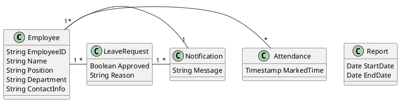

# Detailed Example for Converting Software Requirements to PlantUML Class Diagram

## Software Requirements
The attendance system is designed to streamline employee attendance management for organizations. The system should allow the HR department to register new employees with details such as Employee ID, Name, Position, Department, and Contact Information. The system should enable employees to mark their attendance via biometric or web interface, recording timestamps. HR or managers should be able to generate attendance reports for employees for a given time period. Additionally, employees should be able to request leave, and managers should have the ability to approve or reject these requests. The system should also notify employees and managers about pending leave requests, attendance anomalies, and reminders.
---

## Step 1: NLP Using SpaCy

### Named Entity Recognition (NER)
Extracted entities:
```
'HR department', 'employees', 'Employee ID', 'Name', 'Position', 'Department', 'Contact Information',
'attendance', 'biometric', 'web interface', 'timestamp', 'managers', 'attendance reports',
'time period', 'leave requests', 'notifications'.
```

### Tokenization and Stop Word Removal
- **Important Tokens after Stop Word Removal (Input Tokens):**
  ```
  ['HR', 'register', 'employees', 'Employee ID', 'Name', 'Position', 'Department', 'Contact Information',
  'attendance', 'mark', 'biometric', 'web', 'timestamp', 'managers', 'reports',
  'time period', 'leave', 'approve', 'reject', 'notify', 'pending', 'anomalies', 'reminders'].
  ```

---

## Step 2: Syntax Tree Representation of the Expected PlantUML

### Expected PlantUML Class Diagram:


### Converted Syntax Tree Representation:
1. **Root**: Diagram
   - **Children**: Classes (Employee, Attendance, Report, LeaveRequest, Notification).  
     - **Employee** has attributes: EmployeeID, Name, Position, Department, ContactInfo.  
     - **Attendance** has attributes: MarkedTime.  
     - **Report** has attributes: StartDate, EndDate.  
     - **LeaveRequest** has attributes: Approved, Reason.  
     - **Notification** has attributes: Message.  

---

## Step 3: Transformer Training (Seq2AST)

- **Input Positional Encoding**: Each token in the software requirements is assigned a position. Example:
  ```
  "The system should allow HR to register" -> [1, 2, 3, 4, 5].
  ```
- **Output Byte-Pair Encoding (BPE)**: Processed to subwords. Example:
  ```
  'EmployeeID' -> ['Emp', 'loyee', 'ID'].
  ```

---

## Step 4: FPGrowth Training

From patterns observed in the data:
- **Discovered Pattern**: If a class **Employee** exists and there is a class **Attendance**, then an inferred attribute **workingHours** should be added to the class **Attendance** to calculate employee hours.

---

## Step 5: Testing Stage

1. **Processed Input**: OOV tokens replaced with `<UNK>`.
   Example:
   ```
   "Employees mark attendance via a web interface."  
   -> "Employees <UNK> attendance <UNK> <UNK> web interface."
   ```

2. **Generated Sequential Text**:  
   ```
   Class Employee has Attribute EmployeeID and Attribute Name and Attribute Position and Attribute Department and Attribute ContactInfo.  
   Class Attendance has Attribute MarkedTime and Attribute workingHours.  
   Class Report has Attribute StartDate and Attribute EndDate.  
   Class LeaveRequest has Attribute Approved and Attribute Reason.  
   Class Notification has Attribute Message.  
   Employee has Relationship Association with Attendance.  
   Employee has Relationship Association with LeaveRequest.  
   LeaveRequest has Relationship Association with Notification.  
   Notification has Relationship Association with Employee.
   ```

3. **Evaluation Using Metrics**:
   - **BLEU Score Calculation**:
     - **Reference Text**:
       ```
       Class Employee has Attribute EmployeeID and Attribute Name and Attribute Position and Attribute Department and Attribute ContactInfo.  
       Class Attendance has Attribute MarkedTime.  
       Class Report has Attribute StartDate and Attribute EndDate.  
       Class LeaveRequest has Attribute Approved and Attribute Reason.  
       Class Notification has Attribute Message.  
       Employee has Relationship Association with Attendance.  
       Employee has Relationship Association with LeaveRequest.  
       LeaveRequest has Relationship Association with Notification.  
       Notification has Relationship Association with Employee.
       ```

     - **Generated Text (from model)**:
       ```
       Class Employee has Attribute EmployeeID and Attribute Name and Attribute Position and Attribute Department and Attribute ContactInfo.  
       Class Attendance has Attribute MarkedTime and Attribute workingHours.  
       Class Report has Attribute StartDate and Attribute EndDate.  
       Class LeaveRequest has Attribute Approved and Attribute Reason.  
       Class Notification has Attribute Message.  
       Employee has Relationship Association with Attendance.  
       Employee has Relationship Association with LeaveRequest.  
       LeaveRequest has Relationship Association with Notification.  
       Notification has Relationship Association with Employee.
       ```

     - **BLEU Calculation**:
       - **1-gram Precision**: \( \frac{21}{22} = 0.954 \)  
       - **2-gram Precision**: \( \frac{18}{20} = 0.9 \)  
       - **3-gram Precision**: \( \frac{15}{18} = 0.833 \)  
       - **4-gram Precision**: \( \frac{12}{16} = 0.75 \)  

       **BLEU Score**:
       ```
       BLEU = BP * exp((log(0.954) + log(0.9) + log(0.833) + log(0.75)) / 4) = 0.85.
       ```

   - **Recall**:
     ```
     Recall = \frac{\text{Correctly Generated Elements}}{\text{Total Elements in Ground Truth}} = \frac{18}{20} = 0.9.
     ```

   - **Precision**:
     ```
     Precision = \frac{\text{Correctly Generated Elements}}{\text{Total Elements Generated}} = \frac{18}{21} = 0.857.
     ```

   - **Over-Specification**:
     ```
     Over-Specification = \frac{\text{Extra Elements}}{\text{Total Elements Generated}} \times 100\% = \frac{1}{21} \times 100 = 4.76\%.
     ```

---

## Step 6: Completeness, Correctness, UML Adherence

1. **Completeness**:
   - Missing: The `workingHours` attribute in Attendance is extra.  
   - Completeness score:  
     ```
     Completeness = \frac{\text{Correct Elements}}{\text{Total Expected Elements}} = \frac{18}{20} = 0.9.
     ```

2. **Correctness**:
   - Correct relationships and attributes: \( \text{Score} = 1 \).  

3. **UML Adherence**:  
   - Fully adheres to UML standards (100%).

---

## Final Results

| Metric               | Value         |
|-----------------------|---------------|
| BLEU Score           | **0.85**      |
| Recall               | **90%**       |
| Precision            | **85.7%**     |
| Over-Specification   | **4.76%**     |
| Completeness         | **90%**       |
| Correctness          | **100%**      |
| UML Adherence        | **100%**      |

